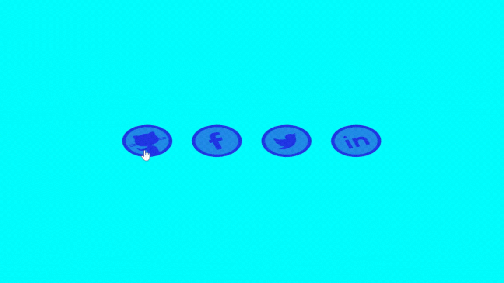
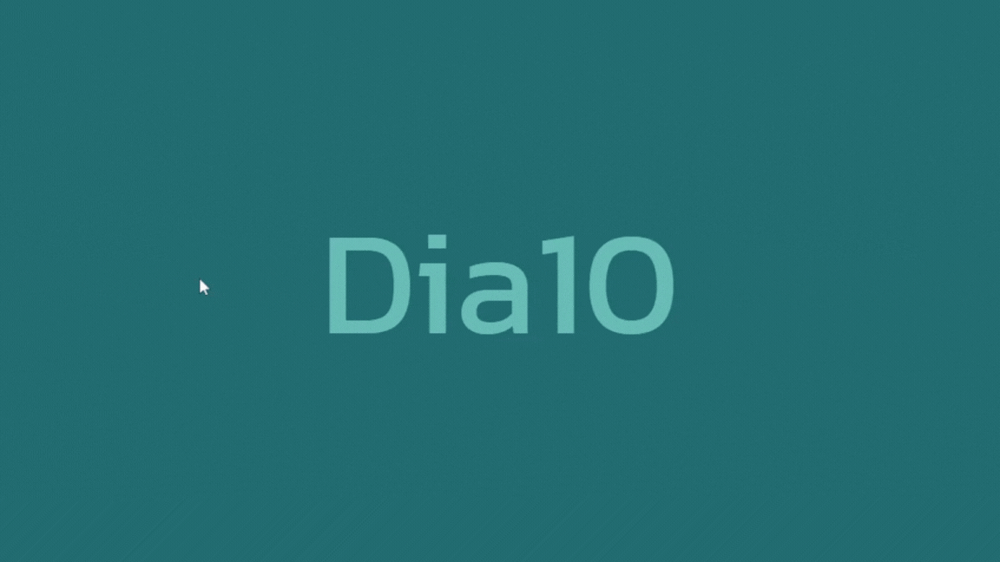
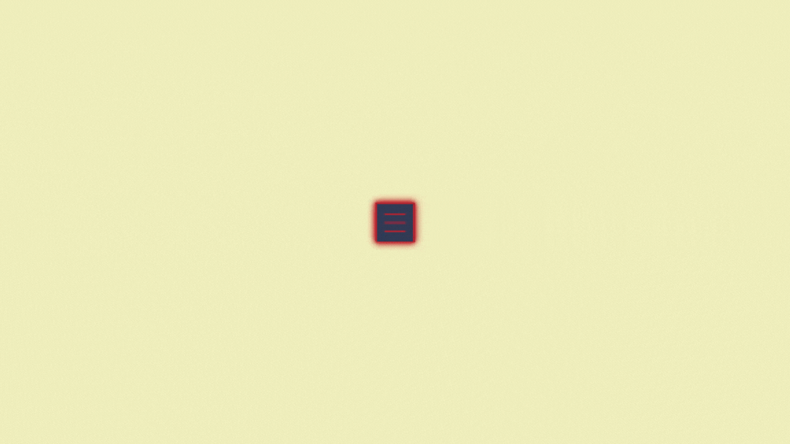

## 🚀 30diasDeCSS 🚀
 
 Oi Pessoal e então, beleza? 😁

 Tembém vou participar desse desafio!

 30 dias de CSS3, é um desafio que visa ajudá-lo a melhorar suas habilidades de codificação fazendo mini projetos diarios utilizando HTML5 e CSS3.

Se gostou da ideia, dá uma olhada nesse repositório que tem mais detalhes 👉 [30diasDeCSS](https://github.com/MilenaCarecho/30diasDeCSS/tree/master) 

* [Dia 01 - Ícone de mídia social em camadas](#id01)
* [Dia 02 - Loader animado](#id02)
* [Dia 03 - Mudança de cor de texto quando entra em outra div](#id03)
* [Dia 04 - Botão com efeito](#id04)
* [Dia 05 - Efeito pulsar](#id05)
* [Dia 06 - Efeito lightning text](#id06)
* [Dia 07 - Preloader animado](#id07)  
* [Dia 08 - Coração batendo](#id08)
* [Dia 09 - Pendulo de Newton](#id09)
* [Dia 10 - Texto esfumaçado](#id10)
* [Dia 11 - Ícone com efeito hover](#id11)
* [Dia 12 - Menu com Hover ](#id12)
* [Dia 13 - Texto flutuante](#id13)
* [Dia 14 - Checked Heart](#id14)
* [Dia 15 - Cards com animação flip](#id15)
* [Dia 16 - Texto com cor animada](#id16)
* [Dia 17 - Barra de pesquisa](#id17)
* [Dia 18 - Botão Fire-Snow/DarkMode](#id18)
* [Dia 19 - Efeito máquina de escrever](#id19)
* [Dia 20 - Efeito deslocar](#id20)
* [Dia 21 - Card expansível](#id21)
* [Dia 22 - Imagens que se expadem](#id22)
* [Dia 23 - Card com hover](#id23)
* [Dia 24 - Título com hover efeito espelhado](#id24)
* [Dia 25 - Tela de login](#id25)
* [Dia 26 - Menu hambúrguer](#id26)
* [Dia 27 - Menu responsivo com Media Queries](#id27)
<!-- * [Dia 28 - Fogos de artificio](#id27)
* [Dia 29 - Slider de imagens](#id28)
* [Dia 30 - Tilt Effect](#id30)

 -->

##  Desafio dia 01 - Ícone de mídia social em camadas 

[Meu codigo](https://github.com/hudney-fsbrito/30-dias-de-css/tree/master/src/Desafios/pages/Dia1)

[Post LinkedIn](https://www.linkedin.com/posts/hudneyfernandes-dev_30diasdecss-activity-7089433458166370304--Odz?utm_source=share&utm_medium=member_desktop) 

##### O que eu aprendi

* *Criar camadas e posicionar utilizando a tag ``*
* *Transform
* *Transitions CSS
* *Opacidade / transparência do CSS
* *hover
* *[nth-child ()](https://www.w3schools.com/cssref/sel_nth-child.asp)*

##  Desafio dia 02 - Loader animado 

[Meu código](https://github.com/hudney-fsbrito/30-dias-de-css/tree/master/src/Desafios/pages/Dia2)

[Post LinkedIn](https://www.linkedin.com/feed/update/urn:li:activity:7089673452965535744/)

##### O que eu aprendi

* *Transform
* *Position
* *Layout
* *[animations](https://www.google.com/search?q=anima%C3%A7%C3%A3o+em+css&sxsrf=AB5stBgUY_Y2hWrbspmAvw_WHOc9VVBkNg%3A1690307265699&ei=wQrAZJGmKv7t1sQPoc6x4AU&oq=nima%C3%A7%C3%A3o+em+css&gs_lp=Egxnd3Mtd2l6LXNlcnAiEG5pbWHDp8OjbyBlbSBjc3MqAggAMgcQABgNGIAEMgYQABgWGB4yBhAAGBYYHjIGEAAYFhgeMgYQABgWGB4yBhAAGBYYHjIGEAAYFhgeMgYQABgWGB4yBhAAGBYYHjIGEAAYFhgeSKY_UABY2DJwAHgBkAEAmAGBAqABxhqqAQYwLjUuMTG4AQHIAQD4AQHCAgcQABiKBRhDwgIIEAAYgAQYsQPCAgsQLhiABBixAxiDAcICCBAuGIAEGLEDwgIFEAAYgATCAgsQLhiABBjHARivAcICBRAuGIAEwgIHEAAYgAQYCsICBhAAGAcYHsICCxAAGAcYHhjxBBgKwgIHEC4YgAQYCsICBxAjGLECGCfCAgoQABiABBixAxgKwgINEAAYgAQYsQMYgwEYCsICBxAjGLACGCfCAgcQLhgNGIAEwgIMEAAYDRiABBhGGP8BwgIGEAAYHhgNwgIIEAAYHhgNGA_CAggQABgIGB4YDeIDBBgAIEGIBgE&sclient=gws-wiz-serp)*

##  Desafio dia 03 - Mudança de cor de texto quando entra em outra div 

[Meu código](https://github.com/hudney-fsbrito/30-dias-de-css/tree/master/src/Desafios/pages/Dia3)

[Post LinkedIn](https://www.linkedin.com/feed/update/urn:li:activity:7090026339029688320/)

##### O que eu aprendi/revi

* *Overflow
* *[blend-mode](https://developer.mozilla.org/pt-BR/docs/Web/CSS/blend-mode)*
* *[animations](https://www.w3schools.com/css/css3_animations.asp)*

##  Desafio dia 04 - Botão com efeito 

[Meu codigo](https://github.com/hudney-fsbrito/30-dias-de-css/tree/master/src/Desafios/pages/Dia4)

[Post LinkedIn](https://www.linkedin.com/feed/update/urn:li:share:7090367202268184576/)

##### O que eu aprendi

* *:hover* 
* *::before*
* *::after*
* *Transições*
* *transformação*

##  Desafio dia 05 - Efeito pulsar 

[Meu codigo](https://github.com/hudney-fsbrito/30-dias-de-css/tree/master/src/Desafios/pages/Dia5)

[Post LinkedIn](https://www.linkedin.com/posts/hudneyfernandes-dev_30diasdecss-frontend-react-activity-7090715689300189184-kBEs?utm_source=share&utm_medium=member_desktop)

##### O que eu aprendi

* *[animations](https://developer.mozilla.org/pt-BR/docs/Web/CSS/animation)*

##  Desafio dia 06 - Efeito lightning text 

[Meu codigo](https://github.com/hudney-fsbrito/30-dias-de-css/tree/master/src/Desafios/pages/Dia6)

[Post LinkedIn](https://www.linkedin.com/feed/update/urn:li:activity:7091090422042697728/)

##### O que eu aprendi

* *animations*
* *nth-child ()*

##  Desafio dia 07 - Preloader animado 

[Meu codigo](https://github.com/hudney-fsbrito/30-dias-de-css/tree/master/src/Desafios/pages/Dia7)

[Post LinkedIn](https://www.linkedin.com/feed/update/urn:li:activity:7091459925352095744/)

##### O que eu aprendi

* *animations*
* *nth-child ()*

##  Desafio dia 08 - Coração batendo 

[Meu codigo](https://github.com/hudney-fsbrito/30-dias-de-css/tree/master/src/Desafios/pages/Dia8)

[Post LinkedIn](https://www.linkedin.com/feed/update/urn:li:share:7091794469091446784/)

##### O que eu aprendi

* *[animations](https://www.w3schools.com/css/css3_animations.asp)*
* *transform: scale()*

##  Desafio dia 09 - Pendulo de Newton 

[Meu codigo](https://github.com/hudney-fsbrito/30-dias-de-css/tree/master/src/Desafios/pages/Dia9)

[Post LinkedIn](https://www.linkedin.com/feed/update/urn:li:share:7092138689006346242/)

##### O que eu aprendi

* *[first-child](https://www.w3schools.com/cssref/sel_firstchild.asp)*
* *[last-child](https://www.w3schools.com/cssref/sel_last-child.asp)*
* *[transform-origin: ; ](https://developer.mozilla.org/pt-BR/docs/Web/CSS/transform-origin)*
* *[transform: rotate(); ](https://developer.mozilla.org/pt-BR/docs/Web/CSS/transform-function/rotate)*

##  Desafio dia 10 - Texto esfumaçado

[Meu código](https://github.com/hudney-fsbrito/30-dias-de-css/tree/master/src/Desafios/pages/Dia10)

[Post LinkedIn](https://www.linkedin.com/feed/update/urn:li:share:7092589718168608768/)

##### O que eu aprendi

* *filter*
* *transformação*
* *:hover*

##  Desafio dia 11 - Ícone com efeito hover 

[Meu codigo](https://github.com/hudney-fsbrito/30-dias-de-css/tree/master/src/Desafios/pages/Dia11)

[Post LinkedIn](https://www.linkedin.com/feed/update/urn:li:activity:7092923932671918080/)

##### O que eu aprendi

* *:hover* 
* *::before*
* *Transições*
* *z-index*

##  Desafio dia 12 - Efeito Hove 

[Meu codigo](https://github.com/hudney-fsbrito/30-dias-de-css/tree/master/src/Desafios/pages/Dia12)

[Post LinkedIn](https://www.linkedin.com/feed/update/urn:li:share:7093414988744187904/)

##### O que eu aprendi

* *:hover* 
* *::before*
* *::after*
* *Transições*

##  Desafio dia 13 - Texto flutuante

[Meu codigo](https://github.com/hudney-fsbrito/30-dias-de-css/tree/master/src/Desafios/pages/Dia13)

[Post LinkedIn](https://www.linkedin.com/feed/update/urn:li:share:7093712180042244097/)

##### O que eu aprendi

* *transformação
* *animations*

##  Desafio dia 14 - Checked Heart

[Meu codigo](https://github.com/hudney-fsbrito/30-dias-de-css/tree/master/src/Desafios/pages/Dia14)

[Post LinkedIn](https://www.linkedin.com/feed/update/urn:li:share:7094060712561393664/)

##### O que eu aprendi

* *[:checked](https://developer.mozilla.org/en-US/docs/Web/CSS/:checked)*
* *[adjacent sibling combinator (+)](https://developer.mozilla.org/en-US/docs/Web/CSS/Adjacent_sibling_combinator)*

##  Desafio dia 15 - Cards com animação flip

[Meu codigo](https://github.com/hudney-fsbrito/30-dias-de-css/tree/master/src/Desafios/pages/Dia15)

[Post LinkedIn](https://www.linkedin.com/feed/update/urn:li:share:7094416739790200832/)

##### O que eu aprendi

* *transform-style: preserve-3d*
* *backface-visibility: hidden*

##  Desafio dia 16 - Texto com cor animada

[Meu codigo](https://github.com/hudney-fsbrito/30-dias-de-css/tree/master/src/Desafios/pages/Dia16)

[Post LinkedIn](https://www.linkedin.com/feed/update/urn:li:share:7094697744249819136/)

##### O que eu aprendi

* *[overflow](https://developer.mozilla.org/pt-BR/docs/Web/CSS/overflow)*

##  Desafio dia 17 - Barra de pesquisa

[Meu codigo](https://github.com/hudney-fsbrito/30-dias-de-css/tree/master/src/Desafios/pages/Dia17)

[Post LinkedIn](https://www.linkedin.com/feed/update/urn:li:share:7095050386230644736/)

##### O que eu aprendi

* *[focus-within](https://pt.stackoverflow.com/questions/387245/com-css-%C3%A9-poss%C3%ADvel-controlar-qual-elemento-vai-ativar-o-focus-within-de-um-form#:~:text=O%20%3Afocus%2Dwithin%20seleciona%20o,de%20estilo%20desejada%20no%20formul%C3%A1rio.)*
* *[focus-within](https://developer.mozilla.org/pt-BR/docs/Web/CSS/:focus-within)*

##  Desafio dia 18 - Botão Fire-Snow/DarkMode

[Meu codigo](https://github.com/hudney-fsbrito/30-dias-de-css/tree/master/src/Desafios/pages/Dia18)

[Post LinkedIn](https://www.linkedin.com/feed/update/urn:li:share:7095503947632717824/)

##### O que eu aprendi

* *[:has()](https://developer.mozilla.org/en-US/docs/Web/CSS/:has)*
* *[:has()](https://pt.stackoverflow.com/questions/13876/alguma-maneira-de-estilizar-elemento-pai-com-css)*

##  Desafio dia 19 - Efeito máquina de escrever

[Meu codigo](https://github.com/hudney-fsbrito/30-dias-de-css/tree/master/src/Desafios/pages/Dia19)

[Post LinkedIn](https://www.linkedin.com/feed/update/urn:li:share:7095826065499000833/)

##### O que eu aprendi

* *[white-space: nowrap;](https://developer.mozilla.org/en-US/docs/Web/CSS/white-space)*
* *[steps()](https://developer.mozilla.org/en-US/docs/Web/CSS/animation-timing-function)*

##  Desafio dia 20 - Efeito descolar

[Meu codigo](https://github.com/hudney-fsbrito/30-dias-de-css/tree/master/src/Desafios/pages/Dia20)

[Post LinkedIn](https://www.linkedin.com/feed/update/urn:li:share:7096266024441774080/)

##### O que eu aprendi

* *overflow*

##  Desafio dia 21 - Card expansível

[Meu codigo](https://github.com/hudney-fsbrito/30-dias-de-css/tree/master/src/Desafios/pages/Dia21)

[Post LinkedIn](https://www.linkedin.com/feed/update/urn:li:share:7096573377842155522/)

##### O que eu aprendi

* *translateY()*
* *z-index*

##  Desafio dia 22 - Imagens que se expadem

[Meu codigo](https://github.com/hudney-fsbrito/30-dias-de-css/tree/master/src/Desafios/pages/Dia22)

[Post LinkedIn](https://www.linkedin.com/feed/update/urn:li:share:7096924684478275584/)

##### O que eu aprendi

* *translateZ()*

##  Desafio dia 23 - Card com hover

[Meu codigo](https://github.com/hudney-fsbrito/30-dias-de-css/tree/master/src/Desafios/pages/Dia23)

[Post LinkedIn](https://www.linkedin.com/feed/update/urn:li:share:7097229247303315457/)

##### O que eu aprendi

* *scale()*

##  Desafio dia 24 - Título com hover eeito espelhado

[Meu codigo](https://github.com/hudney-fsbrito/30-dias-de-css/tree/master/src/Desafios/pages/Dia24)

[Post LinkedIn](https://www.linkedin.com/feed/update/urn:li:share:7097593870670082048/)

##### O que eu aprendi

* *[-webkit-mask-image: linear-gradient()](https://developer.mozilla.org/en-US/docs/Web/CSS/-webkit-mask-box-image)*
* *[-webkit-box-reflect: below linear-gradient())](https://developer.mozilla.org/en-US/docs/Web/CSS/-webkit-box-reflect)*

##  Desafio dia 25 - Tela de login 

[Meu codigo](https://github.com/hudney-fsbrito/30-dias-de-css/tree/master/src/Desafios/pages/Dia25)

[Post LinkedIn](https://www.linkedin.com/feed/update/urn:li:share:7097992271941296128/)

##### O que eu aprendi

* *[Pseudo-classes](https://developer.mozilla.org/pt-BR/docs/Web/CSS/Pseudo-classes)*
* *[:nth-child()](https://developer.mozilla.org/en-US/docs/Web/CSS/:nth-child)*

##  Desafio dia 26 - Menu hmbúrguer 

[Meu codigo](https://github.com/hudney-fsbrito/30-dias-de-css/tree/master/src/Desafios/pages/Dia26)

[Post LinkedIn](https://www.linkedin.com/feed/update/urn:li:share:7098308320481939456/)

##### O que eu aprendi

* *[Pseudo-classes :has](https://developer.mozilla.org/pt-BR/docs/Web/CSS/Pseudo-classes)*
* *[Seletore + ](https://developer.mozilla.org/en-US/docs/Web/CSS/Adjacent_sibling_combinator)*
* *[Seletore > ](https://developer.mozilla.org/en-US/docs/Web/CSS/Child_combinator)*

##  Desafio dia 27 - Menu responsível 

[Meu codigo](https://github.com/hudney-fsbrito/30-dias-de-css/tree/master/src/Desafios/pages/Dia27)

[Post LinkedIn](https://www.linkedin.com/feed/update/urn:li:share:7099028240022876160/)

##### O que eu aprendi

* *[Media Queries](https://developer.mozilla.org/pt-BR/docs/Web/CSS/)*
